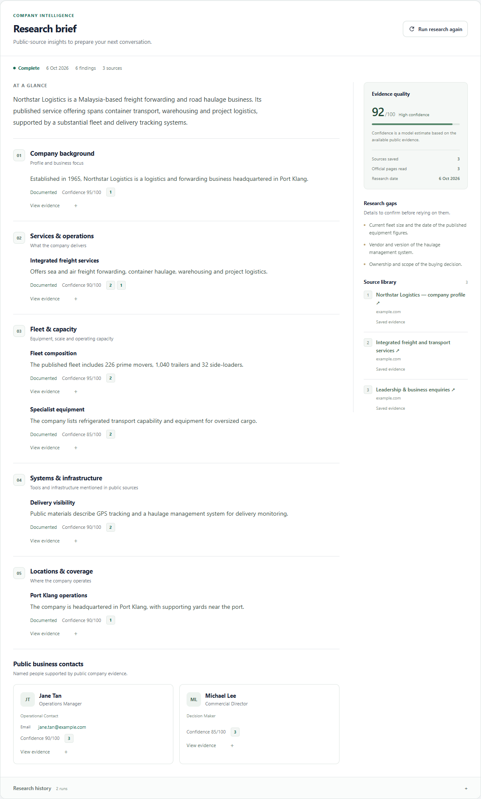

# Company research brief

The lead page presents research as a company brief: an overview, focused findings,
public business contact cards and a separate evidence sidebar. Saved reports use
this layout immediately after deployment. Existing untitled findings remain
supported; new xKiro extractions can supply concise finding titles.

The preview uses a fictional company and illustrative data from the disposable
test environment.

Source numbers belong to the whole report and link to the same source-library
entry everywhere. Quotes and saved page text expand on demand. Hypotheses retain
their label; confidence remains a model estimate. Structured buying signals and
potential needs are displayed once rather than repeated as separate lists.

The latest useful report stays visible during a new run or after a failed retry.
Research history opens earlier runs with their own sources and timestamps.
Empty, queued, running, partial and failed states have dedicated presentation.
The brief appears before company-record details on the lead page and stacks into
one column on mobile.

The DEV research child is published with the revised instructions and title
validation, using the existing xKiro credential. New extraction instructions
request short, focused plain-text findings and classify physical facilities
separately from software and tracking tools. The dashboard owns layout and
escapes untrusted model/source content.

Validation includes 34 n8n tests, five presentation regressions and the disposable
research API/dashboard suite. Browser verification at desktop and mobile widths
checks evidence expansion, citation targets, history selection, queued-report
fallback and horizontal overflow.

## Official contact-page coverage

Research reserves up to two slots inside its existing page-fetch limit for links found on official company pages. Management, leadership, board and director pages are prioritized ahead of contact/enquiry pages. Follow-up URLs must remain on the fetched company host, pass the guarded public-fetch path, and be deduplicated against initial requests. No recursive crawl is performed. Both passes count toward the same fetch budget and usage metrics. Repeated header/navigation/footer text is removed from page evidence while published mail/tel links remain available. Contact selection still requires a named company-linked person with supported individual profile or business email; missing contacts stop for human review.
